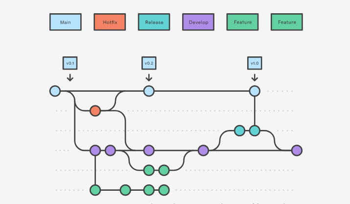

## 目的

git flow工作流实践
## 环境

ubuntu 20.04

### git flow工作流概念

个人理解，应保持有五种分支，分别为release、master、develop、feature、fix



- release，暂时的，master和develop同步的中介
- master，上线的代码
- develop，开发中的代码，累积到一定多的功能release，再将relaese merge到master后删掉release
- feature，开发一个新功能，只开发一个新功能，不改动其他的
- fix，快速修补上线代码的一个bug。


feature，fix开发完一个功能或修补一个bug 在push后就需要merge到develop分支，然后删除掉feature或fix分支。

### 安装git flow工具

```brew install git-flow```

### 初始化仓库

```git flow init```

```bash
#git
git init
....
git branch develop
git push -u origin develop
```

### featrue

开始 ```git flow feature start feature_branch```

```bash
#git
git checkout develop
git checkout -b feature_branch
```


结束 ```git flow feature finish feature_branch```

```bash
#git
git checkout develop
git merge feature_branch
```


### release

```git flow release start 0.1.0```

```bash
#git
git checkout develop
git checkout -b release/0.1.0
```


```git flow release finish '0.1.0'```

```bash
#git
git checkout main
git merge release/0.1.0
```

### hotfix

开始修补

```git flow hotfix start hotfix_branch```

```bash
#git
git checkout main
git checkout -b hotfix_branch
```

修补结束

```git flow hotfix finish hotfix_branch```

```bash
#git
git checkout main
git merge hotfix_branch
git checkout develop
git merge hotfix_branch
git branch -D hotfix_branch
```


## 致谢

[Gitflow Workflow](https://www.atlassian.com/git/tutorials/comparing-workflows/gitflow-workflow)

