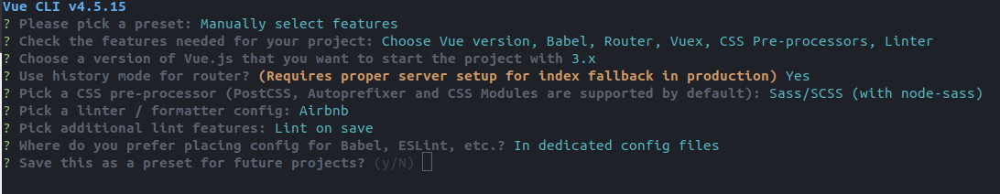

## 目的

安装vue；vue项目实践
## 环境

ubuntu 20.04

### vue安装

```yarn global add @vue/cli```

### vue项目初始化

```vue create vue-try```



使用node v10.24.1初始化成功，高版本可能不行

yarn v1.22.17 应该没关系

### 安装bootstrap vue

根据官网用yarn安装

```yarn add vue bootstrap bootstrap-vue```

使用时发现错误	

```bash
 ERROR  Failed to compile with 1 error                                          7:54:48 AM

 error  in ./src/assets/scss/index.scss

Syntax Error: SassError: Undefined variable: "$custom-control-indicator-size".
        on line 11 of node_modules/bootstrap-vue/src/_variables.scss
        from line 7 of node_modules/bootstrap-vue/src/index.scss
        from line 4 of /home/buffer/project/gitflow-try/vue-try/vue-try/src/assets/scss/index.scss
>> $b-custom-control-indicator-size-lg: $custom-control-indicator-size * 1.25 !
   -------------------------------------^

```

重新安装```yarn add boostrap@4.5.3```后解决

### vuelidate安装

表单验证插件

node 12.*以下的需要安装低版本的vuelidate

[vuelidate文档](https://vuelidate.js.org/#getting-started)

### axios vue-axios安装

```yarn add axios vue-axios```

在```main.js```引入

```js
//注意顺序，不然有错误
import VueAxios from 'vue-axios';
import axios from 'axios';
Vue.use(VueAxios, axios);

```

### vuex使用

在store目录

## 致谢

[官方环境配置文档](https://reactnative.dev/docs/environment-setup)

