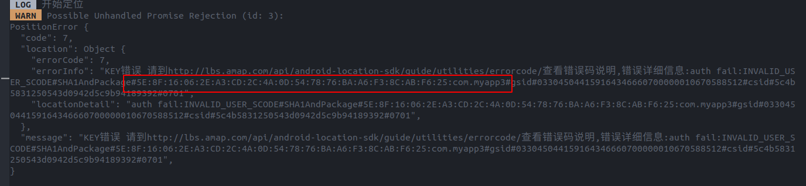

## 目的

react-native开发中遇到的错误记录。

## 环境

ubuntu 20.04

## teaset

1. 

```bash
error: Error: Unable to resolve module react-native/Libraries/Animated/src/Easing from /home/buffer/project/react_project/anroid_project/myApp3/node_modules/teaset/components/ListRow/TouchableOpacity.js: react-native/Libraries/Animated/src/Easing could not be found within the project or in these directories:
  node_modules
  ../../../../node_modules

If you are sure the module exists, try these steps:
 1. Clear watchman watches: watchman watch-del-all
 2. Delete node_modules and run yarn install
 3. Reset Metro's cache: yarn start --reset-cache
 4. Remove the cache: rm -rf /tmp/metro-*

```

### 解决方案

文件
components/ListRow/TouchableOpacity.js
修改
import Easing from 'react-native/Libraries/Animated/src/Easing';
为
import Easing from 'react-native/Libraries/Animated/Easing';

---

2. ```javascript
   // utils/toast.js
   import React from 'react';
   import {ActivityIndicator} from 'react-native';
   import {Toast, Theme} from 'teaset';
   let customKey = null;
   // 打开
   
   Toast.showLoading = text => {
     if (customKey) {
       return;
     }
     customKey = Toast.show({
       text,
       icon: <ActivityIndicator size="large" color={Theme.toastIconTintColor} />,
       position: 'center',
       duration: 6000,
     });
   };
   
   // 关闭
   Toast.hideLoading = () => {
     if (!customKey) {
       return;
     }
     Toast.hide(customKey);
     customKey = null;
   };
   export default Toast;
   
   ```

   ```bash
    ERROR  TypeError: undefined is not an object (evaluating '_$$_REQUIRE(_dependencyMap[10], "../../../utils/toast").Toast.showLoading')
   ```

   ### 解决方案

   console.log发现上面文件中的Toast确实是undefined，然而在其他文件中Toast是[Function Toast]。不断尝试console.log，最后突然不是undefined的时候就解决了。。

## npx react-native run android

```bash
adb server version (39) doesn't match this client (41); killing...


[DeviceMonitor]: Adb connection Error:EOF
[DeviceMonitor]: Cannot reach ADB server, attempting to reconnect.
[Device]: Error during Sync: Connection reset by peer
```

### 解决方案

因为装了两个adb，我系统里之前装过。卸载掉adb，```sudo apt-get remove adb```

## react-native-linear-gradient组件没正常显示

### 解决方案

样式里把**长宽加上**。很多组件没有长宽就无法显示，比如Image

## 矢量图使用

 https://github.com/vault-development/react-native-svg-uri
``` npm install react-native-svg-uri --save ``` 

https://github.com/react-native-svg/react-native-svg
```npm install react-native-svg```   

一开始只装了uri，没有正常显示，再装了第二个正常显示

测试代码

```javascript
import SvgUri from 'react-native-svg-uri';
import React from 'react';
import {View} from 'react-native';
const TestSvgUri = () => (
  <View style={{width: '100%', height: 200}}>
    <SvgUri
      width="200"
      height="200"
      source={{
        uri: 'http://thenewcode.com/assets/images/thumbnails/homer-simpson.svg',
      }}
    />
  </View>
);
export default TestSvgUri;

```

**不是所有的矢量图都可以显示。**

## 使用datepicker插件

```npm install @react-native-community/datetimepicker --save```

实例

```javascript
import React, {Component} from 'react';
import {View, Button, Platform} from 'react-native';
import DateTimePicker from '@react-native-community/datetimepicker';

export default class App extends Component {
  state = {
    date: new Date(1598051730000),
    mode: 'date',
    show: false,
  };
  onChange = (event, selectedDate) => {
    const currentDate = selectedDate || this.state.date;
    this.setState({
      show: Platform.OS === 'ios',
      date: currentDate,
    });
  };

  showMode = currentMode => {
    this.setState({
      show: true,
      mode: currentMode,
    });
  };

  showDatepicker = () => {
    this.showMode('date');
  };

  showTimepicker = () => {
    this.showMode('time');
  };
  render() {
    return (
      <View>
        <View>
          <Button onPress={this.showDatepicker} title="Show date picker!" />
        </View>
        <View>
          <Button onPress={this.showTimepicker} title="Show time picker!" />
        </View>
        {this.state.show && (
          <DateTimePicker
            testID="dateTimePicker"
            value={this.state.date}
            mode={this.state.mode}
            is24Hour={true}
            display="default"
            onChange={this.onChange}
          />
        )}
      </View>
    );
  }
}

```

修改成

```javascript
state={
    birthday: new Date(),
    show: false,
}
...
<View>
          <View
            style={{
              margin: pxToDpWidth(15),
              alignSelf: 'center',
              justifyContent: 'center',
              alignItems: 'flex-start',
              height: pxToDpWidth(20),
              width: '80%',
              borderBottomWidth: pxToDpWidth(2),
              borderColor: '#000000',
            }}>
            {/* <Text>Data</Text> */}
            <TouchableOpacity
              style={{height: pxToDpWidth(35)}}
              onPress={() => {
                this.setState({show: true});
              }}>
              <Text
                style={{
                  fontSize: pxToDpWidth(15),
                  marginLeft: pxToDpWidth(10),
                }}>
                {moment(this.state.birthday).format('LL')}
              </Text>
            </TouchableOpacity>
          </View>
          {this.state.show && (
            <DateTimePicker
              testID="dateTimePicker"
              value={this.state.birthday}
              mode="date"
              display="spinner"
              onChange={(event, time) =>
                this.setState({show: Platform.OS === 'ios', birthday: time})
              }
            />
          )}
        </View>
```

选择时会出错如果

```javascript
//onChange必须这样写， 需要event，show: Platform.OS === 'ios'这个使确认时能关闭
onChange={(event, time) =>
                this.setState({show: Platform.OS === 'ios', birthday: time})
              }
```

## 使用高德地图api

### web api

选```web服务```，不是```web端```js那个

### android平台

```keytool -genkey -v -keystore my-release-key.keystore -alias my-key-alias -keyalg RSA -keysize 2048 -validity 10000```在当前目录下生成名为```my-release-key.keystore```的key

```keytool -list -v -keystore my-release-key.keystore```找到sha1就行

这个貌似不行，反正请求时会告诉你的sha1和包名的，再改掉就行了。



## react-native-amap-geolocation安装使用

### 安装包

```npm install react-native-amap-geolocation ``` 

### 修改配置文件

#### android/settings.gradle

添加

```xml
include ':react-native-amap-geolocation'
project(':react-native-amap-geolocation').projectDir = new File(rootProject.projectDir,'../node_modules/react-native-amap-geolocation/lib/android')
```

#### android/app/build.gradle

dependencies中增加

```xml
dependencies{
	implementation project(':react-native-amap-geolocation') //增加这段
}

```

#### android/app/src.main/java/com/myapp/MainApplication.java

```java
//在开头导入
import  cn.qiuxiang.react.geolocation.AMapGeolocationPackage;
```

```java

protected List<ReactPackage> getPackages() {
          ...
          packages.add(new AMapGeolocationPackage()); //增加这段
          ...
        }
```

**配置文件貌似不用加，有报错的话删掉就好了。我的add new package报错，我就删了，其他已经加了就不管了。**

### 问题

```bash
Attempt to invoke virtual method 'void com.amap.api.location.AMapLocationClient.startLocation()' on a null object reference
```

### 解决方案

要先init，再做别的

## react-native-picker

是这个https://github.com/beefe/react-native-picker

不是这个https://github.com/react-native-picker/picker

测试代码

```javascript
showCityPicker = () => {
    Picker.init({
      pickerData: CityJson,
      selectedValue: ['北京', '北京'],
      wheelFlex: [1, 1, 0], // 显示省和市
      pickerConfirmBtnText: '确定',
      pickerCancelBtnText: '取消',
      pickerTitleText: '选择城市',
      onPickerConfirm: data => {
        // data =  [广东，广州，天河]
        this.setState({
          city: data[1],
        });
      },
    });
    Picker.show();
  };
```

json城市数据文件

```json
[
	{
		"北京": [
			{
				"北京": [
					"东城区",
					"西城区",
					"崇文区",
					"宣武区",
					"朝阳区",
					"丰台区",
					"石景山区",
					"海淀区",
					"门头沟区",
					"房山区",
					"通州区",
					"顺义区",
					"昌平区",
					"大兴区",
					"平谷区",
					"怀柔区",
					"密云县",
					"延庆县"
				]
			}
		]
	},
	{
		"天津": [
			{
				"天津": [
					"和平区",
					"河东区",
					"河西区",
					"南开区",
					"河北区",
					"红桥区",
					"塘沽区",
					"汉沽区",
					"大港区",
					"东丽区",
					"西青区",
					"津南区",
					"北辰区",
					"武清区",
					"宝坻区",
					"宁河县",
					"静海县",
					"蓟  县"
				]
			}
		]
	},
    {
        "河北":[
            {
                "石家庄":[

                ]
            },
            {
                "唐山":[

                ]
            }
        ]
    },
    {
        "浙江":[
            {
                "温州":[
                    "瑞安"
                ]
            },
            {
                "杭州":[
                    "西湖区"
                ]
            },
            {
                "丽水":[
                    
                ]
            }
        ]
    }
]
```

## Image显示gif动画

android/app/build.gradle添加

```jsx
dependencies {
  // If your app supports Android versions before Ice Cream Sandwich (API level 14)
  implementation 'com.facebook.fresco:animated-base-support:1.3.0'

  // For animated GIF support
  implementation 'com.facebook.fresco:animated-gif:2.5.0'

  // For WebP support, including animated WebP
  implementation 'com.facebook.fresco:animated-webp:2.5.0'
  implementation 'com.facebook.fresco:webpsupport:2.5.0'

  // For WebP support, without animations
  implementation 'com.facebook.fresco:webpsupport:2.5.0'
}
```

我在2022.1.30查看的，版本可能会变化。以react native官网更新为准，因为我之前导入了2.0.0发现无法正常显示

## 极光即时通信服务使用

`npm install jmessage-react-plugin --save`

`npm install jcore-react-native --save` 其实在上一步jcore会自动安装

### 包安装后的配置问题

#### android/app/build.gradle

```xml
dependencies {
    implementation project(':jmessage-react-plugin') // 新增的
    implementation project(':jcore-react-native')  // 新增的
}
```

```xml
defaultConfig{
	manifestPlaceholders = [
                JPUSH_APPKEY: "a47ba057faff025d90f2a1aa",	//在此替换你的APPKey
                APP_CHANNEL: "developer-default"		//应用渠道号
        ]
}
```

#### android/settings.gradle

```xml
include ':jmessage-react-plugin'
project(':jmessage-react-plugin').projectDir = new File(rootProject.projectDir, '../node_modules/jmessage-react-plugin/android')
include ':jcore-react-native'
project(':jcore-react-native').projectDir = new File(rootProject.projectDir, '../node_modules/jcore-react-native/android')
```

#### android/app/src/AndroidManifest.xml

```xml
<application...
                ...>
<meta-data android:name="JPUSH_CHANNEL" android:value="${APP_CHANNEL}" />
<meta-data android:name="JPUSH_APPKEY" android:value="${JPUSH_APPKEY}" />
</application>
```

#### 与package.json同级目录下新建react-native.config.js

```js
module.exports = {
  dependencies: {
    'jmessage-react-plugin': {
      platforms: {
        android: {
          packageInstance: 'new JMessageReactPackage(false)'
        }
      }
    },
  }
};
```

测试代码

```jsx
import React from 'react';
import {View, Text} from 'react-native';
import JMessage from 'jmessage-react-plugin';
class App extends React.Component {
  componentDidMount() {
    JMessage.init({
      appkey: 'a47ba057faff025d90f2a1aa',
      isOpenMessageRoaming: true,
      isProduction: false,
      channel: '',
    });

    JMessage.login(
      {
        username: 'hannibal',
        password: '123456',
      },
      res => {
        console.log('登录成功');
        console.log(res);
      },
      err => {
        console.log('登录失败');
        console.log(err);
      },
    );
  }
  render() {
    return (
      <View>
        <Text>goods</Text>
      </View>
    );
  }
}
export default App;

```

## 使用icofont字体

[icofont字体下载链接](https://icofont.com/)

将ttf字体文件放到 **android/app/src/main/assets/fonts**里

使用示例

```jsx
<Text style={{fontFamily: 'icofont', color: 'black', fontSize: 50}}>
            {'\ue82b'}
</Text>
```

## 使用react-native-deck-swiper

`npm install react-native-deck-swiper --save`我是react 17.0.2,直接这样安装有问题

**包的peer dependencies和项目的dependencies版本不同冲突的问题**（peer dependencies 和 dependencies区别参考[这篇博文](https://juejin.cn/post/6971268824288985118)）

`npm i react-native-deck-swiper --legacy-peer-deps`这样安装成功，自动解决了多个包的peer dependencies版本冲突，让不同版本共存。

`npm install react-native-view-overflow`不过事先我装过这个包，如果我理解的问题产生原因有误，可以再尝试把这个包也装上，或许可以解决。

## 时常渲染不出组件，写的没错却看不到组件


`<ImageHeaderScrollView>`组件下的其他组件没有正常显示

页面结构如下

```jsx
<View>
	<ImageHeaderScrollView
        ...(1)
        >
        ...(2)
    </ImageHeaderScrollView>
</View>

```

(2)位置的组件没能正常渲染

### 解决

给`View`加个`flex:1`

下次渲染不出来组件时，可以给最外层元素加个`flex:1`

## Maximum update depth exceeded error

```jsx
{dynamic.album.map((v, k) => {
              return (
                <TouchableOpacity key={k} onPress={this.zoomImage(k)}>
                  <Image
                    key={k}
                    source={{uri: v}}
                    style={{
                      marginTop: pxToDpWidth(5),
                      marginRight: pxToDpWidth(5),
                      width: pxToDpWidth(100),
                      height: pxToDpWidth(100),
                    }}
                  />
                </TouchableOpacity>
              );
            })}
```

### 解决

将`onPress={this.zoomImage(k)}`改为 `onPress={(()=>this.zoomImage(k)}`

传引用而不是直接调用，犯二了。

## object is not a constructor (evaluating 'new ctor(props context)')

使用

```jsx
...
@inject("RootStore")
@observer
class index...
```

### 解决方案

重新run-android

## aurora-imui 极光ui库使用

`npm install aurora-imui-react-native --save `

使用[sample](https://github.com/jpush/aurora-imui/tree/master/ReactNative/sample)中的代码还需要安装fs包

`npm install react-native-fs`

### 问题解决

1. ```bash
    Could not find any matches for cn.jiguang.imui:messagelist:+ as no versions of cn.jiguang.imui:messagelist are available.
        Searched in the following locations:
          - file:/home/buffer/project/react_project/anroid_project/myApp3/node_modules/react-native/android/cn/jiguang/imui/messagelist/maven-metadata.xml
          - file:/home/buffer/project/react_project/anroid_project/myApp3/node_modules/jsc-android/dist/cn/jiguang/imui/messagelist/maven-metadata.xml
          - https://repo.maven.apache.org/maven2/cn/jiguang/imui/messagelist/maven-metadata.xml
          - https://dl.google.com/dl/android/maven2/cn/jiguang/imui/messagelist/maven-metadata.xml
          - https://www.jitpack.io/cn/jiguang/imui/messagelist/maven-metadata.xml
      
   ```

   看起来是找不到包。从[这里](https://developer.android.com/studio/build/dependencies?hl=zh-cn#native_dependencies)了解了下implementation包的原理，有三种形式

   - **本地库模块依赖项**: `implementation project(':mylibrary')`
   - **本地二进制文件依赖项**: implementation fileTree(dir: 'libs', include: ['*.jar'])
   - **远程二进制文件依赖项**: implementation 'com.example.android:app-magic:12.3'

   根据aurura-imui 模块中的build.gradle形式，判断是远程依赖项引入，而错误提示找不到依赖项。

   推测是远程代码仓库不对，从成功运行的aurura-imui的sample中，找到了本地项目中没有的代码仓库

   于是在`android/build.gradle`中加入

   ```xml
   
   allprojects {
       repositories {
           ...
           jcenter() //这个是新添加的
   	
           maven { url 'https://www.jitpack.io' }
       }
   }
   
   ```

   

2. 完成上一步后重新编译

```bash
* What went wrong:
Execution failed for task ':app:processDebugMainManifest'.
> Manifest merger failed : Attribute application@allowBackup value=(false) from AndroidManifest.xml:12:7-34
  	is also present at [cn.jiguang.imui:messagelist:0.8.0] AndroidManifest.xml:12:9-35 value=(true).
  	Suggestion: add 'tools:replace="android:allowBackup"' to <application> element at AndroidManifest.xml:7:5-12:19 to override.
```

```bash
* What went wrong:
Execution failed for task ':app:generateDebugBuildConfig'.
> Error while evaluating property 'buildConfigPackageName' of task ':app:generateDebugBuildConfig'
   > Failed to calculate the value of task ':app:generateDebugBuildConfig' property 'buildConfigPackageName'.
      > Failed to query the value of property 'packageName'.
         > org.xml.sax.SAXParseException; systemId: file:/home/buffer/project/react_project/anroid_project/myApp3/android/app/src/main/AndroidManifest.xml; lineNumber: 20; columnNumber: 52; The prefix "tools" for attribute "tools:replace" associated with an element type "activity" is not bound.

```

这些错误提示就非常友好。

根据提示，在`android/app/src/main/AndroidManifest.xml`中加入

```xml
<manifest 
xmlns:tools="http://schemas.android.com/tools" //新增加的tools，下面会用到的
xmlns:android="http://schemas.android.com/apk/res/android"
  package="com.myapp3">

    <uses-permission android:name="android.permission.INTERNET" />

    <application
      android:name=".MainApplication"
      android:label="@string/app_name"
      android:icon="@mipmap/ic_launcher"
      android:roundIcon="@mipmap/ic_launcher_round"

      android:allowBackup="false" //覆盖值
      tools:replace="android:allowBackup" //解决冲突
	......

```

个人认为高版本的react应该都能自动link，不需要在`settings.gradle android/app/build.gradle android/app/src/main/java/com/myapp/MainApplication.java`里面配置link的内容

- `seetings.gradle`

  ```xml
  include ':app', ':aurora-imui-react-native'
  project(':aurora-imui-react-native').projectDir = new File(rootProject.projectDir, '../node_modules/aurora-imui-react-native/ReactNative/android')
  ```

  

- `android/app/build.gradle`

  ```xml
  dependencies {
      implementation project(':aurora-imui-react-native')
  }
  ```

- `android/app/src/main/java/com/myapp/MainApplication.java`

  ```java
  import cn.jiguang.imui.messagelist.ReactIMUIPackage; // 新增的
  
  public class MainApplication extends Application implements ReactApplication {
    private final ReactNativeHost mReactNativeHost =
        new ReactNativeHost(this) {
  		@Override
          protected List<ReactPackage> getPackages() {
            @SuppressWarnings("UnnecessaryLocalVariable")
            List<ReactPackage> packages = new PackageList(this).getPackages();
            // Packages that cannot be autolinked yet can be added manually here, for example:
            packages.add(new ReactIMUIPackage()); // 新增的
            return packages;		
          }   
        ...
  ```

## mobx-react 

```bash
TypeError: Object is not a constructor (evaluating 'new ctor(props, context)')
```

重启一下项目就好了

## aurura-imui

```bash
Error: Exception in HostFunction: Malformed calls from JS: field sizes are different
```


```jsx
JMessage.sendTextMessage({
    extras:{user: JSON.stringfy(user)}
})
```

接口调用时没有把json数据转为字符串

## react-native-scrollable-tab-view

`npm install react-native-scrollable-tab-view --save`

1. 

```bash
Error: Element ref was specified as a string (viewPager) but no owner was set. This could happen for one of the following reasons:
1. You may be adding a ref to a function component
2. You may be adding a ref to a component that was not created inside a component's render method
3. You have multiple copies of React loaded
```

`multiple copies of React loaded`

使用`npm ls react`发现有两个版本的react，`react-native-scrollable-tab-view`下又安装了`react 16`

### 解决方案

我把`react-native-scrollable-tab-view`里的`react`目录删掉了。

或许还需要`npm install @react-native-community/viewpager`

2. 又遇到this.scrollView.getNode() 不是个函数

   以为是这个包的问题，就听从网上建议换了`npm install reacr-native-scrollable-tab-view-forked`，然而还是有这个问题

   直接删了getNode()，直接使用this,scrollView实例调用后面的方法，解决问题。

## 致谢

[Mobx学习](https://segmentfault.com/a/1190000039808886)

