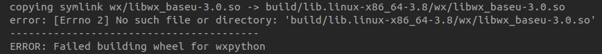

## 目的

安装使用imagepy

## 环境

ubuntu 20.04

## pip安装imagepy

`pip install imagepy`

好像有一些需要的包依赖

`pip install shapely matplotlib`

这没啥问题

## wxpython版本太高

上步完成后，运行失败，搜索解决方案，需要降低wxpython版本,从4.1.x改为4.0.7

安装wxpython4.0.7时

可能时setuptools版本过高了，我用的是58失败了，重新安装setuptools 41版本

最终成功安装wxpython4.0.7

**成功运行imagepython!!!**

## 致谢

