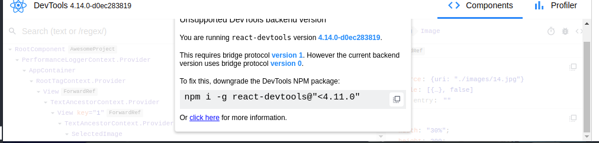
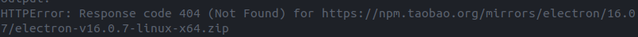
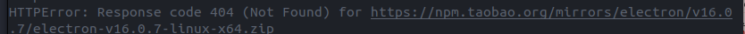

## 目的

配置react native debugger工具
## 环境

ubuntu 20.04

### 根据提示选择合适版本的react-devtools



查了下react-devtools当前支持的版本，选择```yarn global add react-devtools@4.10.4```

### 选择合适版本的react-devtools-core

```json
"resolutions": {
    "react-devtools-core": "4.12.4"
  }
```

我往项目的package.json加了这个，在该文件所在的目录下```yarn install```

### npm global install不要sudo

```sudo chown buffer:buffer node_modules```将该文件改为普通用户所有，可写即可

/usr/bin里链接文件时会出现权限问题，可以再加```sudo```

### npm用nvm安装

nvm可以安装在普通用户目录下，

用apt-get安装的是属于root，权限问题不太好

少用sudo apt-get？

### 换源

npm换源

yarn换源

都在```.npmrc```里改

```bash
registry=http://registry.npm.taobao.org/                                         electron_mirror="https://npm.taobao.org/mirrors/electron/"
```


。。。

### yarn装包404

官方镜像源版本前带有v，换成淘宝镜像源，因为没有带v，所以404

```bash
electron_mirror="https://npm.taobao.org/mirrors/electron/"
electron_custom_dir=16.0.6
```

```.npmrc```改成这样

### 浏览器调试需要跨域设置

在项目 ```index.js```文件中加入

```js
global.XMLHttpRequest = global.crossOriginIsolated || global.XMLHttpRequest;
```


### 工具记录（总）

只对本人

- ```scrcpy_run```投屏物理机
- ```npx react-devtools```查看元素结构
- 启动app会弹出chrome网页，查看console后台输出
- 虚拟机在AS中启动
- ```npx react-native init project_name```初始化项目
- ```npx react-native start```     ```npx react-native run-android```先启动第一个，再执行第二条命令，安装app

## 致谢

[官方环境配置文档](https://reactnative.dev/docs/environment-setup)

